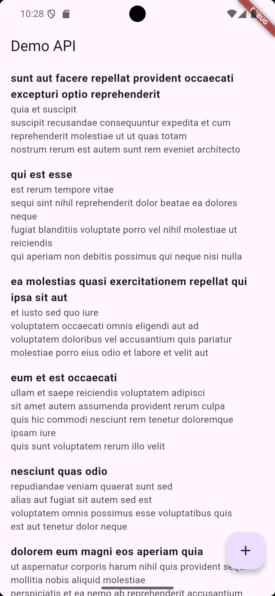
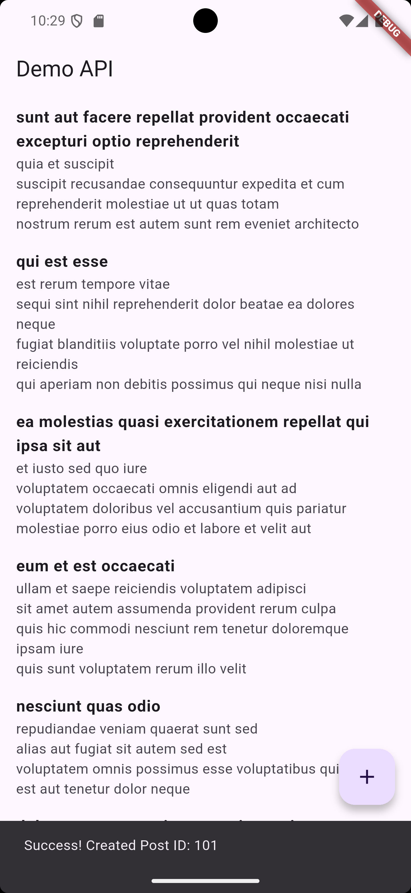

 Creative Flutter REST API App

 Overview

This project is a **Flutter-based mobile application** that demonstrates how a mobile client can communicate with a **remote RESTful API** to retrieve and send data. The app fetches posts from an online server and allows users to create new posts dynamically.

The goal of this project is not only functionality but also **clean architecture, clarity, and real-world relevance**, following best practices taught in mobile application development.


 Purpose of the Project

This application was developed to:

* Demonstrate **REST API consumption** in Flutter
* Apply **asynchronous programming** using Futures and async/await
* Practice **clean separation of concerns** (UI, data, and logic)
* Build a simple but **professional and scalable mobile app**

---

 Key Features

### 1. Remote API Communication

* Fetches data using an HTTP **GET** request
* Sends data using an HTTP **POST** request
* Uses the JSONPlaceholder API as a mock backend server

### 2. Clean Project Structure

The app follows a simple and effective structure:

* **Model** → Defines the data structure (Post)
* **Repository** → Handles all API and network logic
* **UI** → Displays data and handles user interaction

This makes the code readable, reusable, and easy to maintain.

### 3. Asynchronous Data Handling

* Network calls are handled asynchronously
* The UI remains responsive while data loads
* Loading states and errors are properly managed

### 4. Dynamic UI Rendering

* Posts are displayed dynamically using `ListView.builder`
* `FutureBuilder` manages loading, success, and error states
* Content updates automatically based on API responses

### 5. User Feedback

* SnackBars notify users of successful or failed operations
* A floating action button allows users to create new posts

📸 Application Screenshots
1️⃣ Demo API – Fetched Posts
This screenshot shows the main screen of the application where posts are successfully fetched from the remote API and displayed dynamically.
It confirms that the GET request and data rendering are working correctly.





2️⃣ Successfully Created Post
This screenshot shows the confirmation message after creating a new post.
A SnackBar displays the Post ID returned by the server, proving successful POST request execution





Unlike basic Flutter projects that use static or local data, this app:

* Communicates with a **real online API**
* Uses a **repository pattern** instead of mixing logic and UI
* Handles real-world challenges such as network delay and errors
* Is structured in a way that can easily scale to larger applications

This approach reflects **industry-level development practices** rather than beginner-level examples.

---

## 🛠 Technologies Used

* **Flutter & Dart**
* **HTTP package** for network requests
* **JSON** for data exchange
* **Material Design** for UI components

---

## 📂 Project Structure

```
lib/
 ├── model/
 │    └── post.dart
 ├── repository/
 │    └── post_repository.dart
 └── main.dart
```

---

## 🔮 Future Improvements

This project can be extended to include:

* User authentication
* Search and filtering
* Pagination
* Local database caching
* Dark mode support

---

## 📌 Conclusion

This Flutter application demonstrates how mobile apps interact with remote servers in real-world scenarios. It combines clean architecture, asynchronous programming, and a user-friendly interface to produce a simple yet powerful solution.

The project reflects a strong understanding of **Flutter fundamentals**, **API integration**, and **software design principles**, making it suitable for academic evaluation and further expansion.

---

> *Chunne Developed this project as part of an academic exercise to demonstrate modern mobile application development using Flutter.*
  
